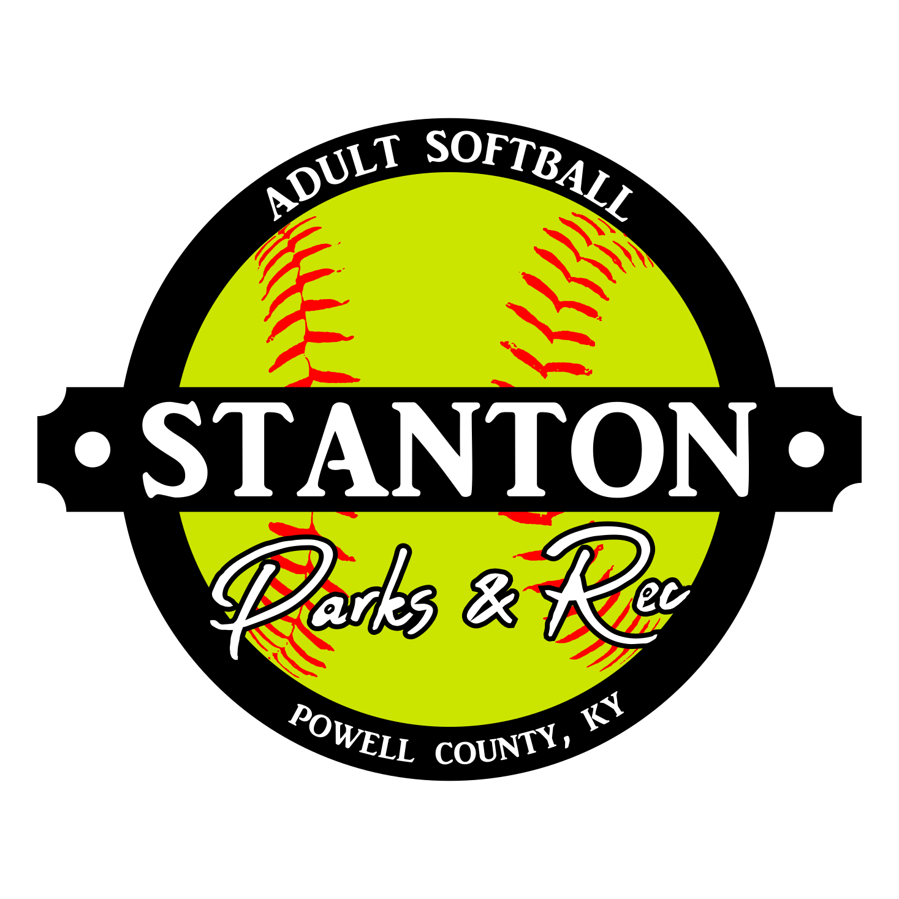

  

# Description

The logo has the standard Stanton Cty Park frame, consisting of the center banner, bottom arched text, and "Parks & Rec" in the southern hemisphere. The unique aspect of the image is the yellow-green softball coloring that composes the circled background and concave stitching that runs from top to bottom on the left and right sides.

# Palette

* **Lettering**: `#FFFFFF`
* **Frame**: `#000000`
* **Inner Background** `#CCE500`
* **Stitching**: `#FF0000`

# Rasterized Images

| Full Name      | Width | Height | Color         | Background Color | Purpose                    | Filemame                                                                                                                                    |
| -------------- | ----- | ------ | ------------- | ---------------- | -------------------------- | ------------------------------------------------------------------------------------------------------------------------------------------- |
| Adult Softball | 1     | 1      | Black & White | Transparent      | Logo                       | [Adult_Softball-1_1-BW-Transparent-Logo.png](Rasterized/Adult_Softball-1_1-BW-Transparent-Logo.png)                                         |
| Adult Softball | 1     | 1      | Color         | Black            | Logo                       | [Adult_Softball-1_1-Color-Black-Logo.png](Rasterized/Adult_Softball-1_1-Color-Black-Logo.png)                                               |
| Adult Softball | 1     | 1      | Color         | Red              | Logo                       | [Adult_Softball-1_1-Color-Red-Logo.png](Rasterized/Adult_Softball-1_1-Color-Red-Logo.png)                                                   |
| Adult Softball | 1     | 1      | Color         | Transparent      | Main Logo                  | [Adult_Softball-1_1-Color-Transparent-Logo.png](Rasterized/Adult_Softball-1_1-Color-Transparent-Logo.png)                                   |
| Adult Softball | 16    | 9      | Color         | Black            | Logo                       | [Adult_Softball-16_9-Color-Black-Logo.png](Rasterized/Adult_Softball-16_9-Color-Black-Logo.png)                                             |
| Adult Softball | 16    | 9      | Color         | Black            | Registration Starting Soon | [Adult_Softball-16_9-Color-Black-Registration_Starting_Soon.png](Rasterized/Adult_Softball-16_9-Color-Black-Registration_Starting_Soon.png) |
| Adult Softball | 16    | 9      | Color         | Black            | Registration               | [Adult_Softball-16_9-Color-Black-Registration.png](Rasterized/Adult_Softball-16_9-Color-Black-Registration.png)                             |
| Adult Softball | 16    | 9      | Color         | Red              | Logo                       | [Adult_Softball-16_9-Color-Red-Logo.png](Rasterized/Adult_Softball-16_9-Color-Red-Logo.png)                                                 |

# Public Use

The use of this image is allowed as long as it meets one of the following criteria:
1. Usage explicitly condoned by the Stanton City Parks & Recreations board or Stanton city employee authorized to represent the Stanton City Park.
2. Usage promoting an event being held at the Stanton City Park that has been approved by the Stanton City Parks & Recreations board or Stanton city employee authorized to represent the Stanton City Park.