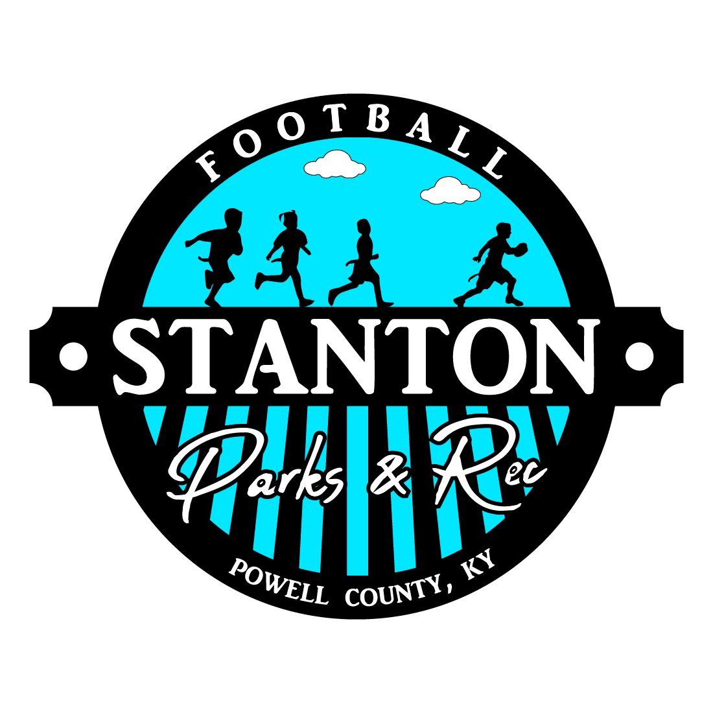

  

# Description

The logo has the standard Stanton Cty Park frame, consisting of the center banner, bottom arched text, and "Parks & Rec" in the southern hemisphere. This has the black/color bars in the southern hemisphere. This is a common element for the league logos. The unique aspect of the image is the football play taking place featuring four kids wearing flags. The three kids on the left are chasing the fourth kid on the right, who has broken away from the pack. There are two clouds above the players.

# Color Palette

* **Lettering**: `#FFFFFF`
* **Frame**: `#000000`
* **Inner Background** `#FF0000`

# Rasterized Images

| Full Name      | Width | Height | Color         | Background Color | Purpose                    | Filename                                                                                                                                    |
| -------------- | ----- | ------ | ------------- | ---------------- | -------------------------- | ------------------------------------------------------------------------------------------------------------------------------------------- |
| Football | 1     | 1      | Black & White | Transparent      | Logo                       | [Football-1_1-BW-Transparent-Logo.png](Rasterized/Football-1_1-BW-Transparent-Logo.png)                                         |
| Football | 1     | 1      | Color         | Black            | Logo                       | [Football-1_1-Color-Black-Logo.png](Rasterized/Football-1_1-Color-Black-Logo.png)                                               |
| Football | 1     | 1      | Color         | Red              | Logo                       | [Football-1_1-Color-Red-Logo.png](Rasterized/Football-1_1-Color-Red-Logo.png)                                                   |
| Football | 1     | 1      | Color         | Transparent      | Main Logo                  | [Football-1_1-Color-Transparent-Logo.png](Rasterized/Football-1_1-Color-Transparent-Logo.png)                                   |
| Football | 16    | 9      | Color         | Black            | Logo                       | [Football-16_9-Color-Black-Logo.png](Rasterized/Football-16_9-Color-Black-Logo.png)                                             |
| Football | 16    | 9      | Color         | Red              | Logo                       | [Football-16_9-Color-Red-Logo.png](Rasterized/Football-16_9-Color-Red-Logo.png)                                                 |

# Public Use

The use of this image is allowed as long as it meets one of the following criteria:
1. Usage explicitly condoned by the Stanton City Parks & Recreations board or Stanton city employee authorized to represent the Stanton City Park.
2. Usage promoting an event being held at the Stanton City Park that has been approved by the Stanton City Parks & Recreations board or Stanton city employee authorized to represent the Stanton City Park.