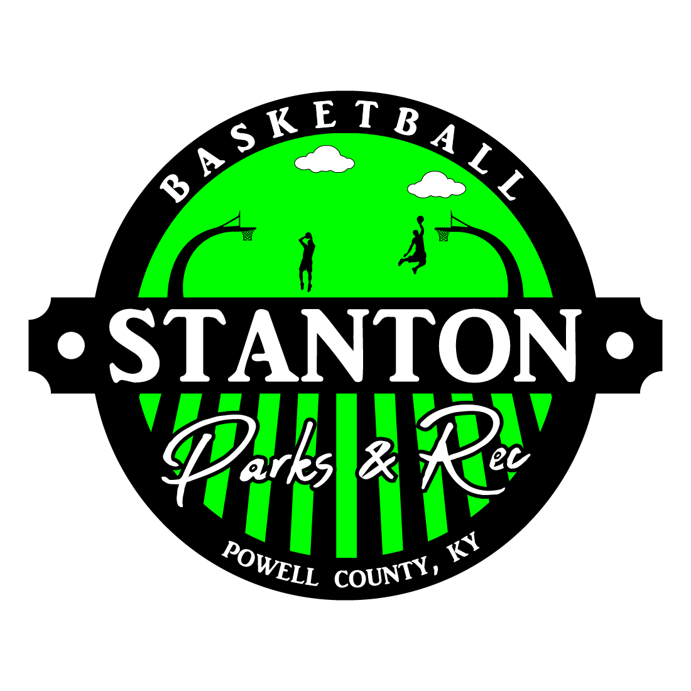
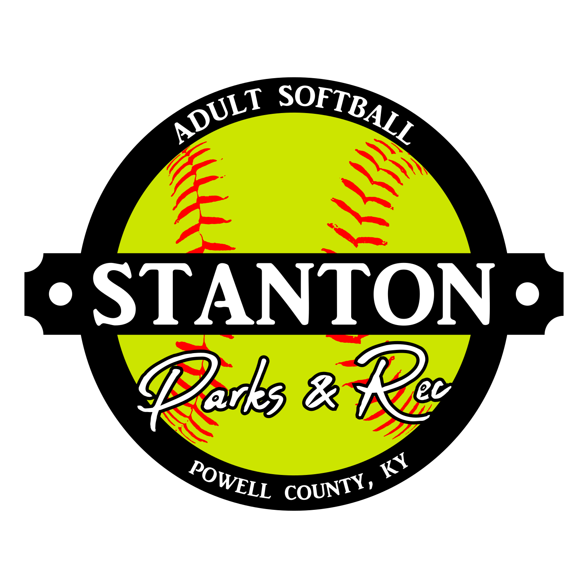

  

  

- [Adult Leagues](#adult-leagues)
  - [Structure](#structure)
  - [Leagues](#leagues)
  - [General Park Rules](#general-park-rules)
  

# Adult Leagues

This directory contains the official rules and guidelines for all leagues and sports at Stanton City Park. Each subfolder provides detailed rules, age guidelines, and league-specific information for the corresponding sport or league.

## Structure

- Each sport or league has its own subfolder (e.g., `Softball`, `Basketball`, etc.).
- Each subfolder contains a `README.md` file with the rules and guidelines for that league.

## Leagues

| Logo | League | Description |
|:----:|:-------|:------------|
|  | [**Basketball**](Basketball/README.md) | Rules and information for the Basketball League. |
|  | [**Softball**](Softball/README.md) | Rules and information for the Adult Co-Ed Softball League. |

## General Park Rules

All participants in any league must adhere to the [Stanton City Park Rules](../../README.md), without exception.

For detailed rules for each league, refer to the `README.md` file in the corresponding subfolder.
