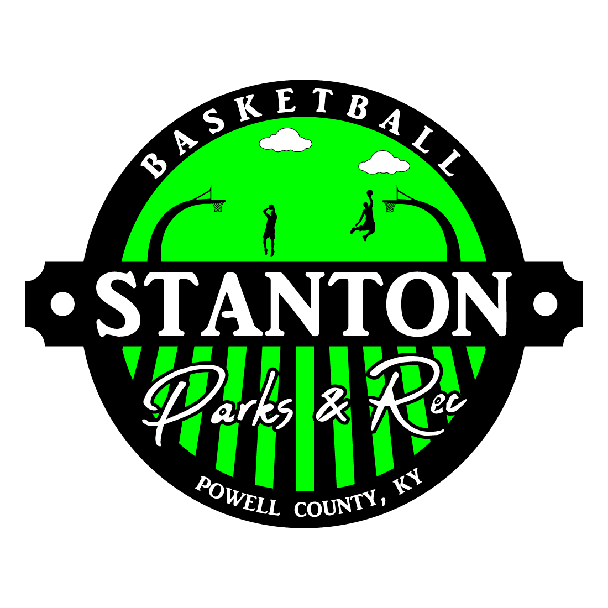

  

<!-- vscode-markdown-toc -->
* 1. [General Park Rules](#GeneralParkRules)

<!-- vscode-markdown-toc-config
	numbering=true
	autoSave=true
	/vscode-markdown-toc-config -->
<!-- /vscode-markdown-toc -->

# Introduction

# Rules

##  1. General Park Rules

All participants will adhere to the [Stanton City Park Rules](../../../Documentation/Rules/README.md), without exception.