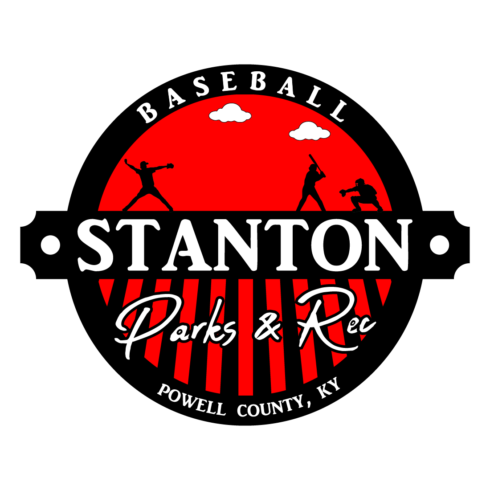

  

        

- [Stanton Parks and Rec Youth Baseball/T-Ball Rules](#stanton-parks-and-rec-youth-baseballt-ball-rules)
  - [General Park Rules](#general-park-rules)
  - [Drafting](#drafting)
  - [League Rules](#league-rules)
    - [Instructional League](#instructional-league)
      - [Eligibility](#eligibility)
      - [Game Administration](#game-administration)
      - [Ball Used](#ball-used)
      - [Bases](#bases)
      - [Regulation Game](#regulation-game)
      - [Players](#players)
      - [Batting](#batting)
      - [Tee/Pitching Guidance](#teepitching-guidance)
      - [Play](#play)
      - [Guidelines](#guidelines)
    - [Junior Coach Pitch](#junior-coach-pitch)
      - [Eligibility](#eligibility-1)
      - [Game Administration](#game-administration-1)
      - [Playing Field](#playing-field)
      - [Regulation Game](#regulation-game-1)
      - [Umpires](#umpires)
      - [Players](#players-1)
      - [Batting](#batting-1)
      - [Tee/Pitching Guidance](#teepitching-guidance-1)
      - [Play](#play-1)
      - [Guidelines](#guidelines-1)
    - [Coach Pitch](#coach-pitch)
      - [Guidelines](#guidelines-2)
    - [Kid Pitch \& Advanced Kid Pitch](#kid-pitch--advanced-kid-pitch)
      - [Guidelines](#guidelines-3)
  - [League Commissioner Override](#league-commissioner-override)

# Stanton Parks and Rec Youth Baseball/T-Ball Rules

Rules can be changed at any time at discretion of the baseball commissioner and/or Parks and Rec Advisory Board. 

## General Park Rules

All participants will adhere to the [Stanton City Park Rules](../../README.md), without exception.

## Drafting 

This league will follow the [Stanton City Park Youth League Drafting](../README.md#youth-league-drafting) rules.

## League Rules

[Official Little League baseball rules](https://www.littleleague.org/playing-rules/little-league-rulebook-app/) will be followed in all circumstances, except when noted below. You can download the Little League rules from their [official Little League Rules app](https://www.littleleague.org/playing-rules/little-league-rulebook-app/).

We will have coaches boxes and painted circle for the pitcher. Coaches are to stay in the boxes and not touch a live player. If this happens, it will only be called out after a called time and a discussion with the umpire. Umpires call stands.

**ALL GAMES WILL BE CALLED AS BEST AS THEY CAN AND THE UMPIRES CALL WILL STAND. QUESTIONABLE CALLS CAN BE DISCUSSED BETWEEN HEAD COACH AND UMPIRE. COACHES GETTING OUT OF HAND AND SPECTATORS BEING RUDE AND USING PROFANITY WILL BE REMOVED FROM GAME/PARK AT UMPIRES CALL. ALSO, BY THE PARK AND REC ZERO TOLERANCE POLICY**

### Instructional League

Instructional League is a developmental league to help teach the basics of baseball.

#### Eligibility
Instructional league is for children aged 3 and 4. Playing age is determined by March 1st of the current year for spring, and September 1st for the fall. No 2-year-olds are allowed to play under any circumstances. 5-year-olds who have never played may be able to play down in instructional at discretion of the commissioner.

#### Game Administration
No official score or standings will be kept, and this league will not have a tournament or champion game.

#### Ball Used
Rawlings TVB Sponge Rubber Core Ball

#### Bases
The distance between each base will be 60 feet. The distance from home plate to the pitcher’s mound will be 46 feet.

#### Regulation Game
Games will consist of a minimum of two innings with no new inning starting after 50 minutes of play unless agreed upon by both team’s head coach.

#### Players
All players in instructional league are allowed to play in the field while on defense. Each team must have one player in each of the following positions: pitcher, catcher, 1st base, 2nd base, 3rd base and shortstop. All remaining players will be considered outfielders and need to be spaced out evenly in the outfield grass. The catcher will not wear traditional catching gear but will wear a baseball helmet while playing in the position.

#### Batting
All instructional league players will bat when on offense. A team’s turn will be over once all players bats. There is penalty for batting out of order and each player must wear a helmet when batting and running bases. No on deck batters allowed.

#### Tee/Pitching Guidance
All batters can use the tee when it is their turn to bat. The coach can pitch to the batter at their discretion three pitches after the three pitches, the player needs to return to hitting off the tee for their turn.

#### Play
Once the ball has stopped, TIME will be called. Overthrow to 1st and 3rd bases allow for one additional base. No parents are allowed on the field. Only coaches are allowed on the field while their team is playing defense and need to make every effort to not interfere with the ball while in play. Coaches whose team is on offensive can have one coach at both 1st and 3rd, and home plate. The home plate coach will be responsible for making sure the bat and tee is moved out of the way for any play at home. All coaches can give instructions to their runners.

#### Guidelines
- Each side bats through before switching sides.
- Put children in desired positions and encourage them to throw the ball to first when hit in the field.
- Games are at least one hour. Try to get at least two bats in each.
- Staying in there position is important.
- Encourage children to go on the field with their coaches.
- 3+ coaches helps.
- If coach wants they can throw 3 pitches to child before tee.

### Junior Coach Pitch

Junior Coach Pitch is geared toward teaching the players the fundamentals of baseball and prepare them for regular Coach Pitch.

#### Eligibility
Junior Coach Pitch is for players aged 5 & 6. Any other age is an exception and must be approved by the baseball commissioner. Age is determined by March 1st in the spring, and September 1st in the fall.

#### Game Administration
The league can keep score; however, no standing will be kept, and there will be no championship tournament or games. The ball will be a Rawlings OLB3 ball. Home team listed on the game schedule will occupy the 3rd bade dugout, and the game balls will be provided by the umpire. Legal bats for this age must be stamped with the USA baseball stamp. No USSSA bats allowed.

#### Playing Field

#### Regulation Game
The game must consist of at least 2 innings, and no new inning can start after 50 minutes of play unless approved by both coaches, and no game is starting behind the current game.

#### Umpires
There is no official umpires in this league, however coaches are responsible for making fair calls and not to interfere with the game.

#### Players
All players are allowed to play in the field while on defense. Each team must have one player in each of the following positions; pitcher, catcher, 1st base, 2nd base, 3rd base and shortstop. All remaining players will be considered outfielders and need to be spaced out evenly in the outfield grass. The catcher will not wear traditional catching gear but will wear a baseball helmet while playing in the position.

#### Batting
Each team will bat until there are three outs, or 6 runs. Each player must bat at least once. If there are players who haven’t got to bat by the team’s last at bat, the players will get the chance to bat. If a batter strikes out, that is included as an at bat.

#### Tee/Pitching Guidance
No tee will be used in this league. Each player will get 5 coach pitches. If no hit is made by the fifth pitch, excluding fouls, the player will be out. The coach may pitch under or overhanded based on their own preference.

#### Play
Once the ball has stopped, TIME will be called. Overthrow to 1st and 3rd bases allow for one additional base. No parents are allowed on the field. Only coaches are allowed on the field while their team is playing defense and need to make every effort to not interfere with the ball while in play. Coaches whose team is on offense can have one coach at both 1st and 3rd, and on the pitcher’s mound. The team one defense will have a coach at home plate coach, and they will be responsible for making sure the bat and tee is moved out of the way for any play at home. All coaches can give instructions to their runners. Once the ball is put into play, the pitcher coach must leave the field and move to foul territory to ensure they do not interfere with the game and ball at play. The pitcher coach should remain out of the way until time is called. If the ball stops, TIME must be called. If the ball goes into the dug out or out of the field unless a home run, TIME must be called. Coaches must stand in coach boxes on both 1st and 3rd base.

#### Guidelines
- 3 outs or 6 runs causes a switch in field position.
- No stealing, leading off or bunting.
- Games are 1:15 minute limit.
- 5 pitches/ 5 swings. No tee
- Baseballs will be hard center balls.
- Fill all infield positions. You can also have a child behind the plate. After positions are field use the outfield for the rest of the team but they must be in the grass.
- Runners get one extra base on an over throw
- If the ball is hit to the outfield, let them run.

### Coach Pitch

#### Guidelines
- Score is on.
- 3 outs or 6 runs, whichever comes first.
- No bunting, stealing or leading off.
- 5 pitches per at bat. Can continue to swing with a foul on last
- One extra base on an over throw that goes out of play.
- On any overthrow and the ball is in play the runner can advance until the ball is threw In and stopped by the umpire.
- Coaches must pitch from the painted line or circle.
- Games are 1:30, no new inning will start after 1:10
- When batting the only child allowed outside the dugout is the batter and on deck hitter where a helmet must be worn.
- Bat throwing after a hit is a warning and may result in batter being out.
- Players can play up from another league if not enough show up but players never play down.
- Each player must have at least one at bat and one inning in the field per game.
- Questionable calls can be discussed with the umpire with the head coaches.
- Sliding is needed at second, third and home on a play being made or they may be called out.
- No headfirst sliding, feet first only.

### Kid Pitch & Advanced Kid Pitch

#### Guidelines
- 3 outs or 6 runs
- Bunting and stealing is allowed. Stealing after ball crosses plate
- Dropped strike 3/ no running from batter
- Pitch count: 75 pitches per game, if they go over they can finish batter. 11/12 pitch count 85
- 21-35 pitches requires one day rest
- 36-50 requires two days rest
- Anything after 50 requires 3 days rest
- Sliding is needed at second, third and home on a play being made or they may be called out.

## League Commissioner Override

The league commissioner may, at their discretion, override, modify, add, or remove any rules in order to provide a safe, fair, and competitive league.