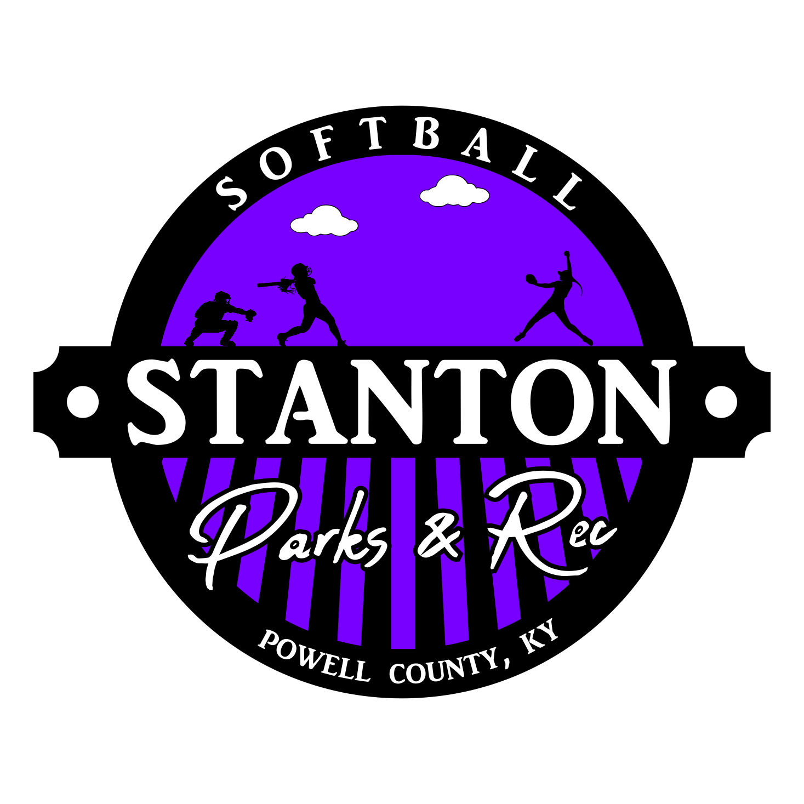

  

  

# League Rules Directory

This directory contains the official rules and guidelines for all leagues and sports at Stanton City Park. Each subfolder provides detailed rules, age guidelines, and league-specific information for the corresponding sport or league.

## Structure

- Each sport or league has its own subfolder (e.g., `Softball`, `Baseball`, `Soccer`, `AdultSoftball`, etc.).
- Each subfolder contains a `README.md` file with the rules and guidelines for that league.

## Contents

| Logo | League | Description |
|:----:|:-------|:------------|
|  | [**Adult Basketball**](AdultBasketball/README.md) | Rules and information for the Adult Basketball League. |
|  | [**Adult Softball**](AdultSoftball/README.md) | Rules and information for the Adult Co-Ed Softball League. |
|  | [**Baseball**](Baseball/README.md) | Rules and information for the Youth Baseball League. |
|  | [**Basketball**](Basketball/README.md) | Rules and information for the Youth Basketball League. |
|  | [**Football**](Football/README.md) | Rules and information for the Youth Football League. |
|  | [**Soccer**](Soccer/README.md) | Rules and information for the Youth Soccer League. |
|  | [**Softball**](Softball/README.md) | Rules and information for the Youth Softball League. |
|  | [**Volleyball**](Volleyball/README.md) | Rules and information for the Youth Volleyball League. |

## General Park Rules

All participants in any league must adhere to the [Stanton City Park Rules](../README.md), without exception.

For detailed rules for each league, refer to the `README.md` file in the corresponding subfolder.
