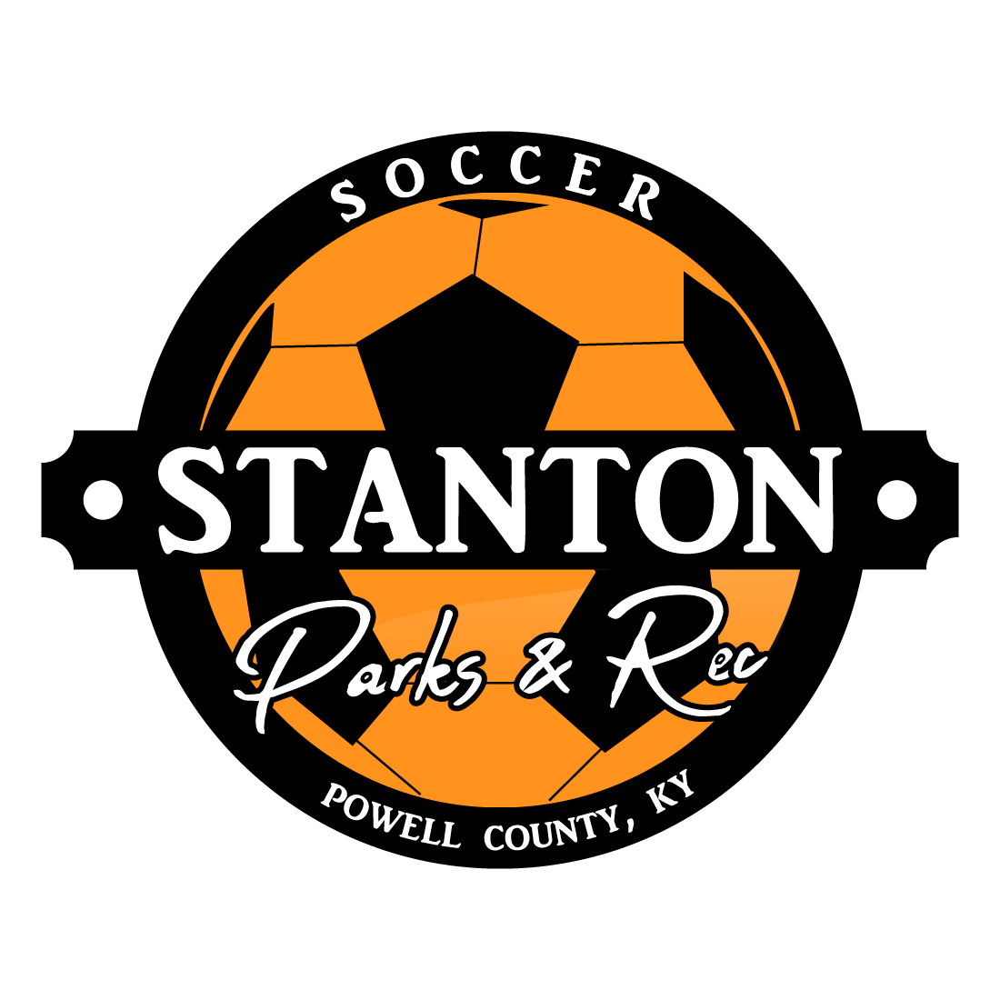

  

        

- [Stanton Parks and Rec Youth Soccer Rules](#stanton-parks-and-rec-youth-soccer-rules)
  - [General Park Rules](#general-park-rules)
  - [Drafting](#drafting)
  - [League Rules](#league-rules)
    - [4U Division](#4u-division)
    - [6U Division](#6u-division)
    - [8U Division](#8u-division)
    - [12U Division](#12u-division)

# Stanton Parks and Rec Youth Soccer Rules

## General Park Rules

All participants will adhere to the [Stanton City Park Rules](../../README.md), without exception.

## Drafting 

This league will follow the [Stanton City Park Youth League Drafting](../README.md#youth-league-drafting) rules.

## League Rules

This is a general guide of what we would love to see the kids learning in their respective age divisions. The main thing is that we want them to have fun, make friends, fall in love with the sport, learn how to play correctly, and keep playing as they grow up. It is always okay to teach them more, but these are the basics for their division.

Please remember that the Refs (8U and 12U only) are high school players, and like anyone else, may make mistakes. If you have an issue, please let me know. I do not want to hear about my Refs being yelled at by coaches and/or parents. As the coach, parents need to listen to you first. If a situation gets out of hand, call me. This has only happened once in the past, so hopefully it will not be something you will deal with.

### 4U Division

- **5 v 5**
- **Out of Bounds**: Make sure players understand that if the ball passes over the line, play stops. At this age, instruct that the ball is played back into the field through kick-ins.
- **No Hands**: Please instruct that there is to be no use of hands during the matches.
- **No Corner Kicks**
- **No Goalies**
- **No Throw-Ins**

### 6U Division

- **6 v 6**
- **Out of Bounds**: Make sure players understand that if the ball passes over the line, play stops.
- **No Hands**
- **No Goalies**: A single sweeper can be played in front of the goal, but they are restricted to feet only.
- **Corner Kicks**: If the ball exits the back of the field and is last touched by the defending team, it results in a corner kick by the offensive team. The ball is then kicked from the corner arch towards the goal or a teammate.
- **Goal Kicks**: If the ball exits the back of the field and is touched last by the offensive team, it results in a goal kick. The ball is placed on the small box line and is kicked into play by the Sweeper or a Defensive player.
- **No Throw-Ins**: If the ball exits the field on either side, the team who did not touch it last will kick it back into play at that spot. At this age we are still trying to break the habit of using hands and that is why we do not coach goalkeeping or throw-ins.
- **Positions**: Learning the basics of positions on the field. Teaching not to ball chase.

### 8U Division

- **7 v 7**
- **Out of Bounds**: Make sure players understand that if the ball passes over the line, play stops.
- **No Hands**: Hand Ball – if the ball hits a player anywhere below the shoulder (Ref’s discretion on call) unless it is a reaction to defending from a hard kick.
- **Goalies**: A single player can be played as a goalie. They are allowed to make full use of their hands and feet.
- **Goalie Save**: When a goalie makes a save (catch, has control) they can return the ball into play several different ways:
  - Punt – goalie can carry the ball to anywhere within the box and punt it into play.
  - Throw – goalie can carry the ball to anywhere within the box and throw it into play or to a teammate.
  - Roll – goalie can carry the ball to anywhere within the box and roll it into play or to a teammate.
- **Corner Kicks**: If the ball exits the back of the field and is last touched by the defending team, it results in a corner kick by the offensive team. The ball is then kicked from the corner arch towards the goal or a teammate.
- **Goal Kicks**: If the ball exits the back of the field and is touched last by the offensive team, it results in a goal kick. The ball is placed on the small box line and is kicked into play by the Goalie or a Defensive player.
- **Throw-Ins**: If the ball exits the field on either side, the team who did not touch it last will throw it back into play at that spot.
  - Technique:
    - Ball must be thrown with 2 hands
    - Ball must be thrown from over top of the head
    - Both feet must remain on the ground during the throw-in
    - No offsides during a Throw-In
- **Offsides**: The offensive players must not be behind (closer to their scoring goal) the defense’s lowest (closest to their defending goal) player, excluding the goalie. If it occurs, the play is dead, and the defensive team will receive the ball in the spot that the offside violation occurred.
- **Positions**: Coaching the fundamentals of positions on the field and the importance of playing them versus ball chasing. Includes goalie, defense, and offense. Tons of 7v7 formations on the internet to research. “Pass the ball” or “Shoot the ball,” we do NOT “kick the ball.”

### 12U Division

- **9 v 9**
- **Out of Bounds**: Make sure players understand that if the ball passes over the line, play stops.
- **No Hands**: Hand Ball – if the ball hits a player anywhere below the shoulder (Ref’s discretion on call) unless it is a reaction to defending from a hard kick.
- **Goalies**: A single player can be played as a goalie. They are allowed to make full use of their hands and feet.
- **Goalie Save**: When a goalie makes a save (catch, has control) they can return the ball into play several different ways:
  - Punt – goalie can carry the ball to anywhere within the box and punt it into play.
  - Throw – goalie can carry the ball to anywhere within the box and throw it into play or to a teammate.
  - Roll – goalie can carry the ball to anywhere within the box and roll it into play or to a teammate.
- **Corner Kicks**: If the ball exits the back of the field and is last touched by the defending team, it results in a corner kick by the offensive team. The ball is then kicked from the corner arch towards the goal or a teammate.
- **Goal Kicks**: If the ball exits the back of the field and is touched last by the offensive team, it results in a goal kick. The ball is placed on the small box line and is kicked into play by the Goalie or a Defensive player.
- **Throw-Ins**: If the ball exits the field on either side, the team who did not touch it last will throw it back into play at that spot.
  - Technique:
    - Ball must be thrown with 2 hands
    - Ball must be thrown from over top of the head
    - Both feet must remain on the ground during the throw-in
    - No offsides during a Throw-In
- **Offsides**: The offensive players must not be behind (closer to their scoring goal) the defense’s lowest (closest to their defending goal) player, excluding the goalie. If it occurs, the play is dead, and the defensive team will receive the ball in the spot that the offside violation occurred.
- **Positions**: Coaching the fundamentals of positions on the field and the importance of playing them versus ball chasing. Includes goalie, defense, midfield, and offense. Tons of 7v7 formations on the internet to research. “Pass the ball” or “Shoot the ball,” we do NOT “kick the ball.”

