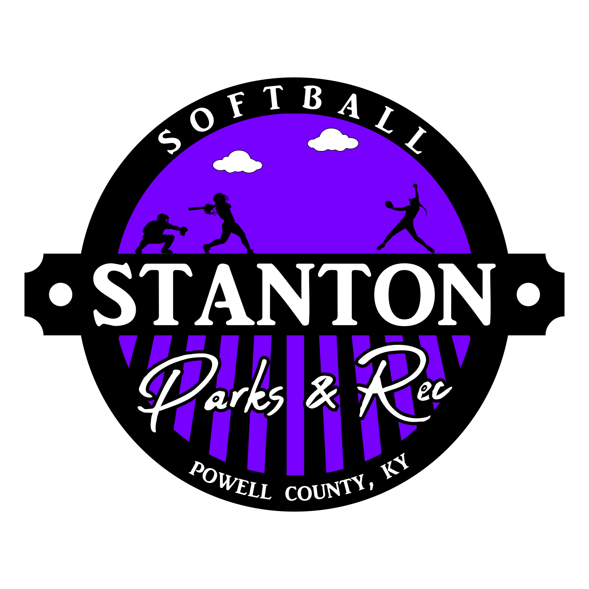

  

        

- [Stanton Parks and Rec Youth Softball Rules](#stanton-parks-and-rec-youth-softball-rules)
  - [General Park Rules](#general-park-rules)
  - [Drafting](#drafting)
  - [League Rules](#league-rules)
  - [T-Ball \& Instructional League Rules](#t-ball--instructional-league-rules)
  - [Coach Pitch and Kid Pitch Rules](#coach-pitch-and-kid-pitch-rules)
  - [League Commissioner Override](#league-commissioner-override)
- [League Concepts](#league-concepts)
  - [Instructional League](#instructional-league)
  - [T-Ball](#t-ball)
  - [Coach Pitch](#coach-pitch)
  - [Kid Pitch](#kid-pitch)

# Stanton Parks and Rec Youth Softball Rules

## General Park Rules

All participants will adhere to the [Stanton City Park Rules](../../README.md), without exception.

## Drafting 

This league will follow the [Stanton City Park Youth League Drafting](../README.md#youth-league-drafting) rules.

## League Rules

1. All Coaches/Assistant Coaches are expected to always present themselves in a professional and appropriate manner. This includes:

   1. No foul language at the ball field
   2. Being respectful to parents, players, scorekeepers and umpires.

1. Any issues with a parent should be directed to the League Commissioners

1. All players are required to play an equal amount of time each game.
1. All coaches must host a parent meeting at the first practice of the season. Topics to cover are the rules, practice and game times, online scheduling, and how to file complaints.
1. The umpires runs the games and their call is indisputable. No one will override their decisions in a game. Issues about a call or an umpire should be directed through the coach to the League Commissioner. Parents should not go directly to the League Commissioner to complain about umpires.
1. Canceling practices will be at the coach’s discretion.
1. Canceling games will be done by the League Commissioner.
1. Bullying and berating any child will not be tolerated.

**ALL GAMES WILL BE CALLED AS BEST AS THEY CAN AND THE UMPIRES CALL WILL STAND. QUESTIONABLE CALLS CAN BE DISCUSSED BETWEEN HEAD COACH AND UMPIRE. COACHES GETTING OUT OF HAND AND SPECTATORS BEING RUDE AND USING PROFANITY WILL BE REMOVED FROM GAME/PARK AT UMPIRES CALL. ALSO, BY THE PARK AND REC ZERO TOLERANCE POLICY**

## T-Ball & Instructional League Rules

1. Softball pants are not required.

## Coach Pitch and Kid Pitch Rules

1. Softball pants are required. No shorts allowed.
2. The scorekeepers’ book is the ultimate source of truth for scoring issues.
3. Face mask for helmets and regular fielding face mask are required. Players may not go on to the field without them.

## League Commissioner Override

The league commissioner may, at their discretion, override, modify, add, or remove any rules in order to provide a safe, fair, and competitive league.

# League Concepts

## Instructional League

1. **Positions**: Players should be taught the positions, as well as the responsibilities for each position.
2. **Scoring**: Players should be taught how to run to bases, stay on bases, etc.
3. **Hitting**: Players should be taught how to swing a bat in order to make solid contact with a ball.

## T-Ball

## Coach Pitch

1. **Sliding**: Kids should begin learning to slide in to bases. Proper sliding technique should be taught as early in the season as possible.

## Kid Pitch

1. **Game Management**: Pitchers should be taught strategies and tactics for game management.