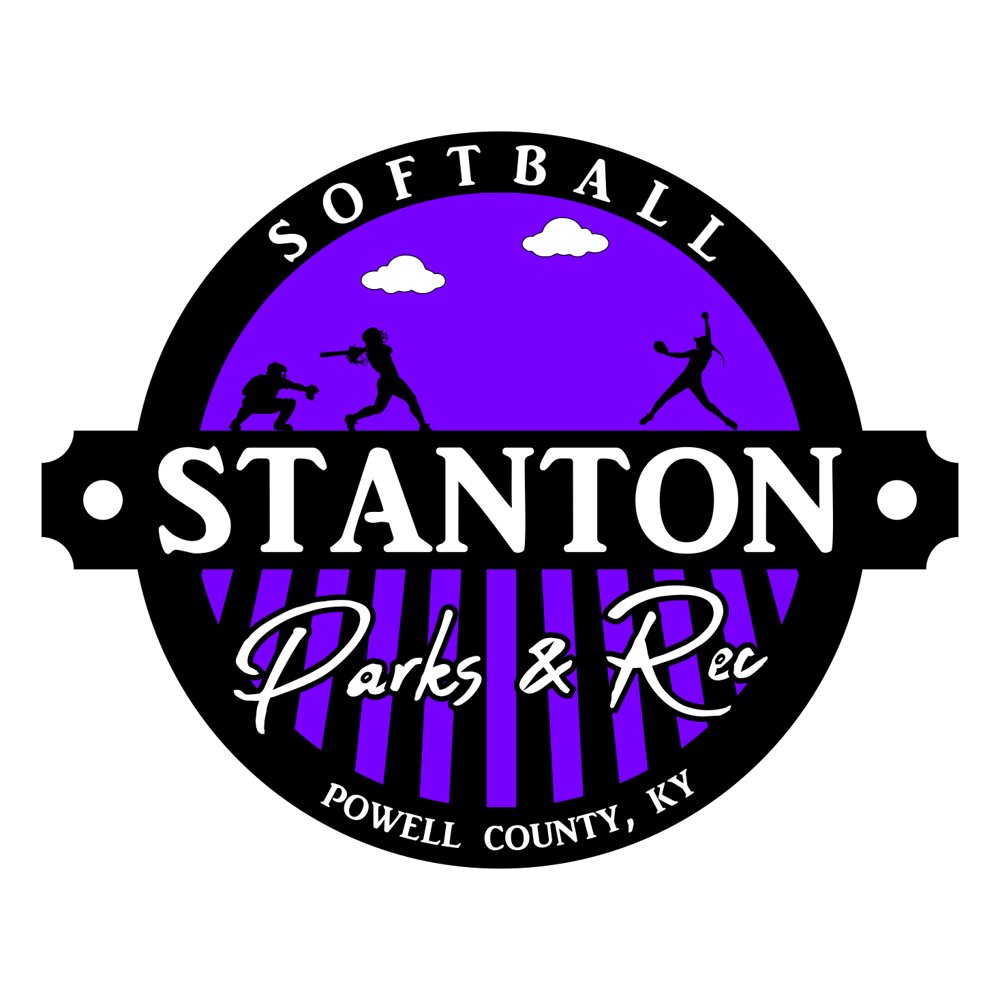

  

        

- [Stanton Parks and Rec Youth Softball Rules](#stanton-parks-and-rec-youth-softball-rules)
  - [General Park Rules](#general-park-rules)
  - [Drafting](#drafting)
  - [League Rules](#league-rules)
  - [T-Ball \& Instructional League Rules](#t-ball--instructional-league-rules)
  - [Coach Pitch Rules](#coach-pitch-rules)
  - [Modified Kid/Coach Pitch Rules](#modified-kidcoach-pitch-rules)
  - [Kid Pitch Rules](#kid-pitch-rules)
  - [League Commissioner Override](#league-commissioner-override)
- [League Concepts](#league-concepts)
  - [Instructional League](#instructional-league)
  - [T-Ball](#t-ball)
  - [Coach Pitch](#coach-pitch)
  - [Kid Pitch](#kid-pitch)

# Stanton Parks and Rec Youth Softball Rules

## General Park Rules

All participants will adhere to the [Stanton City Park Rules](../../README.md), without exception.

## Drafting 

This league will follow the [Stanton City Park Youth League Drafting](../README.md#youth-league-drafting) rules.

## League Rules

1. All Coaches/Assistant Coaches are expected to always present themselves in a professional and appropriate manner. This includes:

   1. No foul language at the ball field
   2. Being respectful to parents, players, scorekeepers and umpires.

1. Any issues with a parent should be directed to the League Commissioners

1. All players are required to play an equal amount of time each game.
1. All coaches must host a parent meeting at the first practice of the season. Topics to cover are the rules, practice and game times, online scheduling, and how to file complaints.
1. The umpires runs the games and their call is indisputable. No one will override their decisions in a game. Only head coach may have a discussion with umpire about a call; final decision remains with the umpire and their call will stand. Issues about a call or an umpire should be directed through the coach to the League Commissioner. Parents should not go directly to the League Commissioner to complain about umpires.
1. The scorekeepers' book is the ultimate source of truth for scoring issues. Head coach, umpire, and score keeper may discuss if there is an issue, but whatever the book keeper has is final.
1. Canceling practices will be at the coach's discretion, but coaches must make every effort to keep practice times and notify the commissioner of changes.
1. Canceling games will be done by the League Commissioner. Best effort will always be made to make a decision in a timely manner.
1. Bullying and berating any child will not be tolerated.
1. Every girl in each age group is required to wear a fielding face mask while on the field, and a batting helmet with a mask while hitting.
1. NO metal cleats are allowed in any age group.
1. T-Ball teams are drafted by commissioner. All other divisions will participate in evaluation day and be drafted according to the park's drafting rules.

**ALL GAMES WILL BE CALLED AS BEST AS THEY CAN AND THE UMPIRES CALL WILL STAND. QUESTIONABLE CALLS CAN BE DISCUSSED BETWEEN HEAD COACH AND UMPIRE. COACHES GETTING OUT OF HAND AND SPECTATORS BEING RUDE AND USING PROFANITY WILL BE REMOVED FROM GAME/PARK AT UMPIRES CALL. ALSO, BY THE PARK AND REC ZERO TOLERANCE POLICY**

## T-Ball & Instructional League Rules

1. Softball pants are not required.
1. The T-Ball division is purely instructional to teach young kids the game and spark their interest for the sport.
1. Games will consist of no less than 3 innings, and have a 50 minute time limit.
1. This division does NOT keep score, and does NOT have a tournament at the end of the season.
1. All players on the team can play the field at once.
1. Teams will bat through the entire roster before switching innings.
1. There are NO outs, and NO stealing. Players will work on fielding the ball and throwing it to 1st base. Runner will stop at 1st, and runners will run around the bases until the last player hits.
1. While this is T-Ball, coaches will also work with older players on transferring to coach pitch for the next season. Coaches may pitch to players they believe are ready by giving them 3 coach pitches then moving on to the Tee to keep the game moving.
1. There are no umpires present for T-Ball; the game is run by the coaches of each team.
1. No parents are allowed on the field during the game unless coach permits it to help with players.

## Coach Pitch Rules

1. Softball pants are required. No shorts allowed.
1. The coach pitch division will keep score every game, and have a tournament at the end of the season.
1. Games will consist of 5 innings or a 1 hour 15 minute time limit.
1. 3 outs or the 5 run limit in the inning switches the inning.
1. This division plays by the normal softball rules with the following exceptions:
   - No drop 3rd strike
   - No in field fly rule
   - No stealing bases on the pitch
   - No walks
1. Each team will bat their entire roster, but only 10 players playing the field at a time. All players must play the field once in a game, coaches are required to rotate players each game so no one player is sitting the most every game.
1. Each batter will be given 5 pitches from the coach standing at the outside edge of the circle and will be allowed 2 foul balls. If batter does not hit after that batter will be counted out.
1. Batters may run until the play is dead. Play is not dead until the player throws the ball to the coach that is pitching.
1. When play is called dead by Umpire if runner is over half way they advance to the next base. If they are under half way runner must return to previous base. This is at the umpires discretion and can not be questioned.
1. There is no leading off in this division, player cannot leave the base until ball is hit.

## Modified Kid/Coach Pitch Rules

1. Softball pants are required. No shorts allowed.
1. This division is designed to bridge the players transition from coach pitch to kid pitch. This division will keep score every game, and have a tournament at the end of the season.
1. Games will consist of 5 innings or a 1 hour 15 minute time limit.
1. 3 outs or the 5 run limit in the inning switches the inning.
1. This division plays by the normal softball rules with the following exceptions:
   - No drop 3rd strike
   - No in field fly rule
   - No stealing bases on the pitch
   - No walks
1. Each team will bat their entire roster, but only 10 players playing the field at a time. All players must play the field once in a game, coaches are required to rotate players each game so no one player is sitting the most every game.
1. Each batter will start with Kid pitch, the kid will pitch until player hits the ball, strikes out, or gets to ball 4. There are no walks in this age group once we get to ball 4, coach will take over pitching to the batter until they hit or strike out.
1. Batters may run until the play is dead. Play is not dead until the player throws the ball to the player playing pitcher in the pitchers circle.
1. When play is called dead by Umpire if runner is over half way they advance to the next base. If they are under half way runner must return to previous base. This is at the umpires discretion and can not be questioned.
1. We will be working on leading off in this division, players may lead off the base once the ball leaves the pitchers hand (player or coach).

## Kid Pitch Rules

1. Softball pants are required. No shorts allowed.
1. The kid pitch division will keep score every game, and have a tournament at the end of the season.
1. Games will consist of 5 innings or a 1 hour 15 minute time limit.
1. 3 outs or the 6 run limit in the inning switches the inning.
1. This division plays by the KHSAA softball rules/guidelines with the following exceptions:
   - No in field fly rule
1. Each team will bat 10 players at a time, and 10 players playing the field at a time. All players must play the field and bat once each game, coaches are required to rotate players each game so no one player is sitting out the most every game.
1. Batters may run until the play is dead. Play is not dead until the ball is in the pitchers hands in the pitching circle. Once pitcher is in the circle and runners are off the base they must commit to going back or going forward. Once pitcher is on the rubber anyone off the base is out.
1. Players cannot lead off until the ball leaves the pitchers hand.
1. **IMPORTANT GAME OF SOFTBALL RULES TO REMEMBER:**
   - Players may run on drop 3rd strike if 1st base is not occupied and there is less than 2 outs. Players can only run to 1st base on a drop 3rd strike and 1st is occupied IF there is 2 outs.
   - When the last out of the inning is a force, any run that crossed home plate on that play DOES NOT count.

## League Commissioner Override

The league commissioner may, at their discretion, override, modify, add, or remove any rules in order to provide a safe, fair, and competitive league.

# League Concepts

## Instructional League

1. **Positions**: Players should be taught the positions, as well as the responsibilities for each position.
2. **Scoring**: Players should be taught how to run to bases, stay on bases, etc.
3. **Hitting**: Players should be taught how to swing a bat in order to make solid contact with a ball.

## T-Ball

## Coach Pitch

1. **Sliding**: Kids should begin learning to slide in to bases. Proper sliding technique should be taught as early in the season as possible.

## Kid Pitch

1. **Game Management**: Pitchers should be taught strategies and tactics for game management.